# hilingo (Pera Soft)

Bu uygulama, **Pera Soft'a** ait olan **"hilingo: ingilizce konuş"** adlı uygulama seçilerek yapılan bir staj case'idir.

## Proje Hakkında

Bu uygulama, Flutter kullanılarak geliştirilmiştir. Uygulama, MVVM mimarisine sadık kalınarak tasarlanmıştır. Backend servisi olarak Firebase (Authentication & Firestore) kullanılmıştır.

Öne Çıkan Özellikler:

- **Güvenli Kimlik Doğrulama:** Kullanıcı girişi Firebase Auth ile sağlanır. (E-posta ve Google ile giriş yap özelliği)
- **Lingo AI ile konuşma simülasyonu:** Bir arama arayüzü ile bir mock screen ile sağlanır. Konuşma başına kullanıcıya Firestore üzerinden 50 XP yazılır. (Ücretsiz plan için 2 dakika, Premium plan için sınırsız) Süre bitiminde otomatik sonlandırılıp Paywall ekranına yönlendirme.
- **İlerleme Ekranı:** Firestore üzerinde tutulan seri ve puan değişkeni ile kullanıcı bir sıralama ile kendi gelişimini görebilir.
- **Profil Ekranı:** Firestore üzerinde tutulan kullanıcı adını ve şifresinin değişikliğinin sağlandığı ekrandır. Aynı zamanda Premium Üyelik durumunu da kontrol edebilir. Çıkışlar da bu ekrandan sağlanır.
- **Splash Screen:** flutter_native_splash kütüphanesi ile özel bir splash screen tasarlanmıştır.
- **Paywall Screen:** Kullanıcının ödeme planını seçtiği ekrandır.

## Teknolojiler ve Kullanılan Kütüphaneler

- **Framework:** Flutter
- **State Management:** Provider
- **Backend:** Firebase (Auth ve Firestore)
- **Mimari:** MVVM
- **flutter_native_splash:** Özel Splash ekranı için
- **smooth_page_indicator:** Onboarding ekranındaki sayfa geçişleri için
- **google_fonts:** Uygulama için kullanılan Urbanist adlı yazı tipi için
- **google_sign_in:** Google ile giriş yapma özelliğinin sağlanması için kullanılmıştır.

## Proje Yapısı
- **constant:** Projede kullanılan renklerin tutulduğu sabit klasörü
- **model:** Onboarding ekranının modelin (veri yapısının) tutulduğu klasör
- **service:** Oturum ve veritabanı işlemleri için kullanılan servislerin tutulduğu klasör
- **view:** Tasarım dosyalarının tutulduğu klasör
- **viewmodel:** Tasarım dosyaları ile veriler arasındaki veri akışını sağlayan ViewModel'lerin tutulduğu klasördür.

## Uygulama Akışı
- Splash Screen
- Landing Screen
- Onboarding Screen
- Auth (Login, Register) Screen
- Paywall Screen -> Home Screen (Yeni üye olunduysa)
- Home Screen (Kayıtlı üye giriş yaptıysa)
- AI Call, Progress ve Profile ekranlarına HomeScreen üzerinden erişilebilir.

## Ekran Görüntüleri

<table>
  <tr>
    <td> 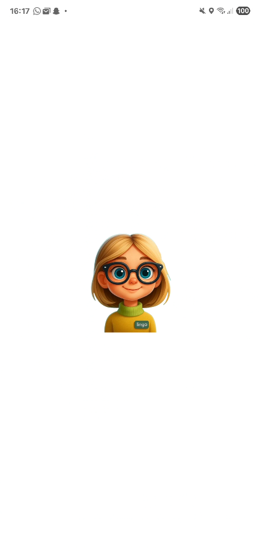</td>
   </tr> 
</table>

<table>
  <tr>
    <td> 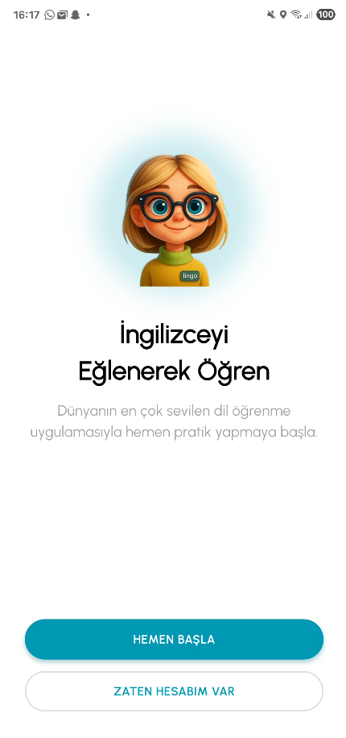</td>
   </tr> 
</table>

<table>
  <tr>
    <td> 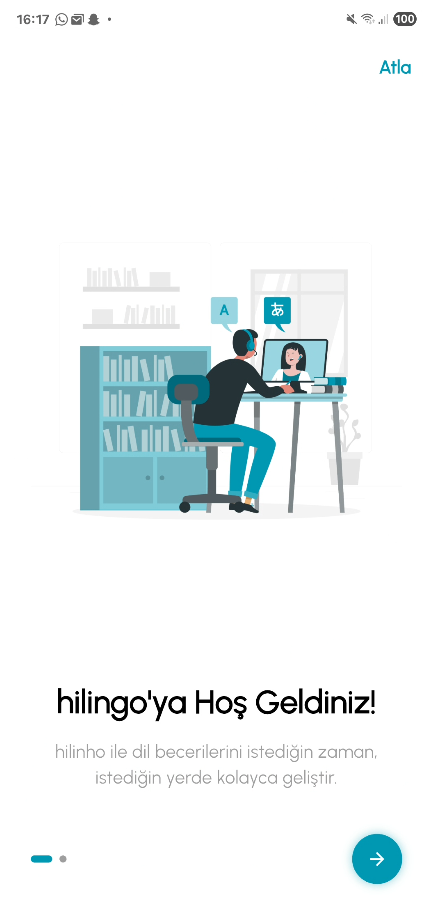</td>
   </tr> 
</table>

<table>
  <tr>
    <td> 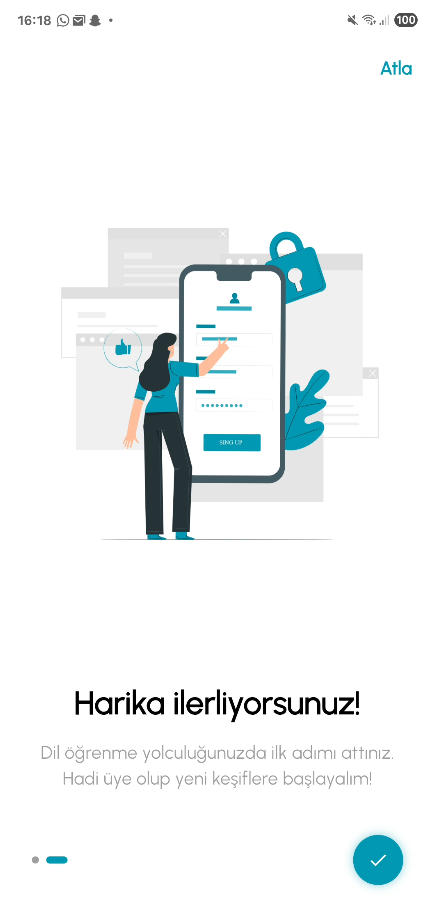</td>
   </tr> 
</table>

<table>
  <tr>
    <td> 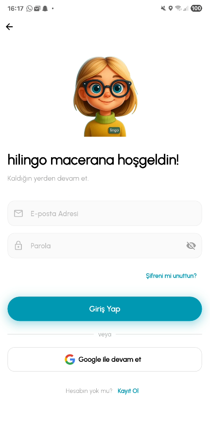</td>
   </tr> 
</table>

<table>
  <tr>
    <td> 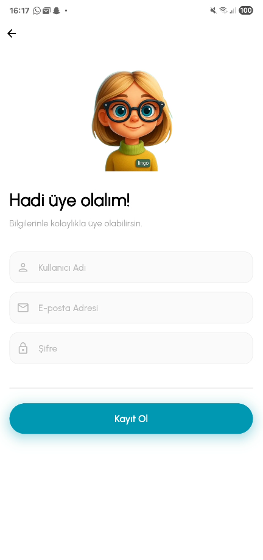</td>
   </tr> 
</table>

<table>
  <tr>
    <td> 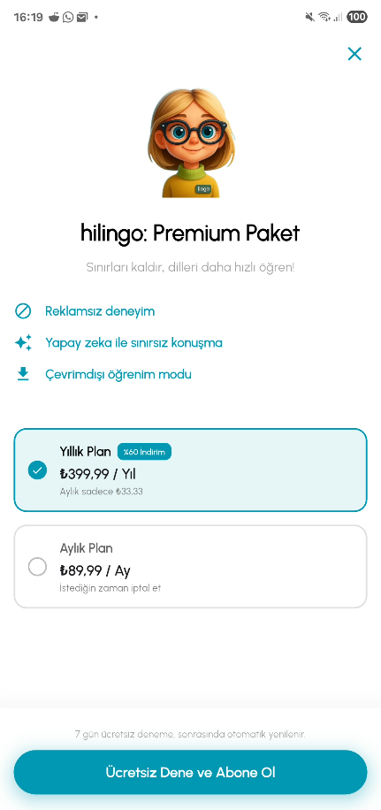</td>
   </tr> 
</table>

<table>
  <tr>
    <td> 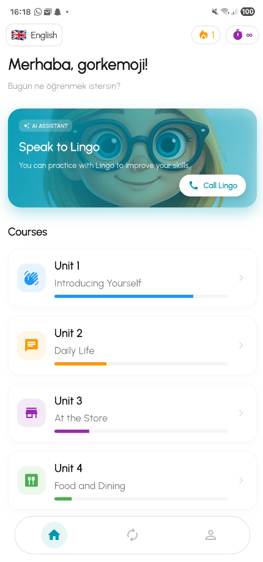</td>
   </tr> 
</table>

<table>
  <tr>
    <td> </td>
   </tr> 
</table>

<table>
  <tr>
    <td> </td>
   </tr> 
</table>

<table>
  <tr>
    <td> 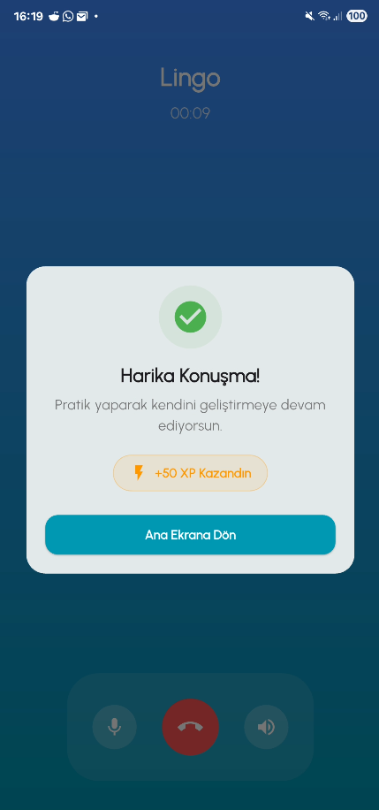</td>
   </tr> 
</table>

<table>
  <tr>
    <td> 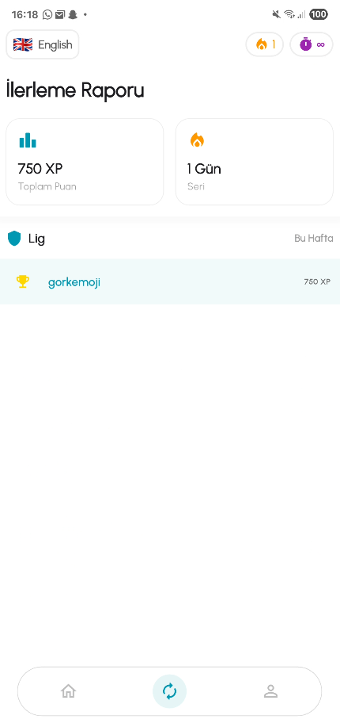</td>
   </tr> 
</table>

<table>
  <tr>
    <td> 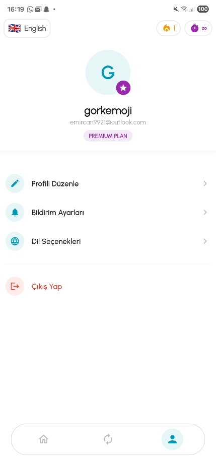</td>
   </tr> 
</table>

<table>
  <tr>
    <td> 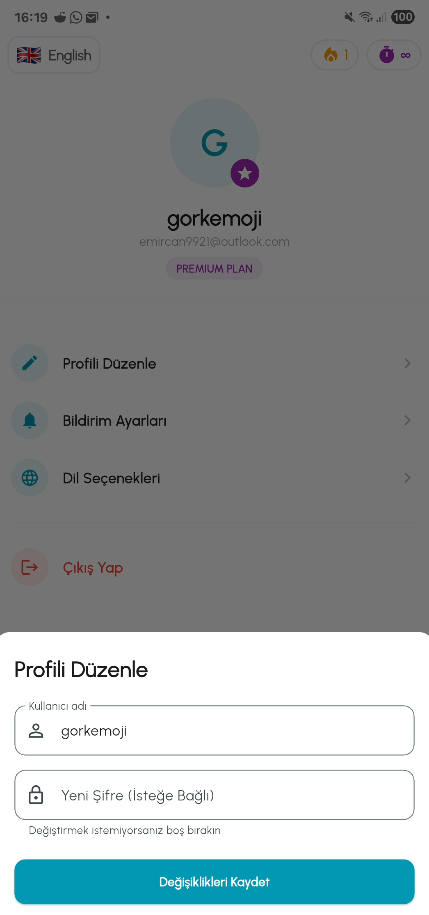</td>
   </tr> 
</table>

## Kurulum
Projeyi yerel ortamda çalıştırmak için:

1. Projeyi klonlayın.

   ```bash
   git clone https://github.com/gorkemoji/internship_project_template.git
   cd internship_project_template

2. Paketleri yükleyin.

   ```bash
   flutter pub get
   
3. Firebase yapılandırması projenin içerisinde mevcuttur. Bu nedenle ekstra bir ayar yapmadan çalıştırabilirsiniz.

4. Cihazınızı bilgisayarınıza bağlayın ve uygulamayı başlatın.

   ```bash
   flutter run
